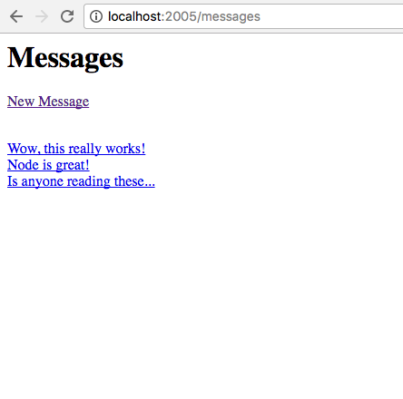
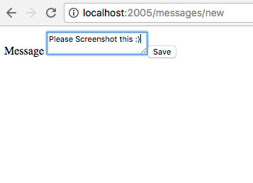
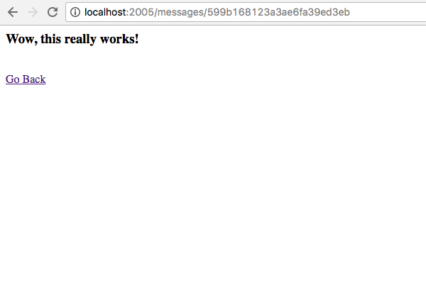
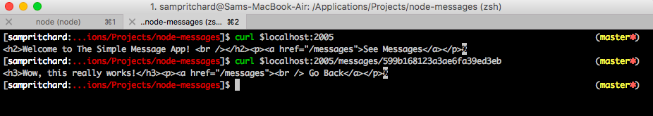

# A Simple Plain Message Application Built in Node

The task: Develop a simple web service which allows users to store and retrieve plain text messages.

## How to Run
* Clone or download this repo to your local machine
* Navigate to the project folder in your terminal
* Run **npm install** to install the dependencies used for this project
* Type **node app.js**, and then navigate to http://localhost:2005/ to see the app in the browser
* To run the tests, run **npm test**
* To see the app running in the terminal, type **node app.js**, open a new tab on your terminal, and type **curl $localhost:2005/messages/599afaa774c87e693e51dd81**. You can subsitute the long ID out the end, to whatever ID you see in the route in the browser.

### Technologies Used
* Node.js
* Express.js
* Pug
* MongoDB & Mongoose **for database**
* Mocha & Zombie **for testing**
* Travis CI **for Integration**

### Approach
I used a MVC (Model, View, Controller) approach to separate files simply, where the model was **Message.js** and the controller was **messageController.js**. The views were split depending on what route the user takes. I also separated by route file in **index.js**.

I used a TDD approach using Mocha & Zombie. Overall coverage of the code was 94%, and in order to get that higher, I need to test the **createMessage** function in the messageController.js file.

I used Pug as I find it a nice and simple template over HTML.

### Lessons Learned
* I struggled originally with how to interact with my data and see if it was doing what was expected. This lesson really taught me the importance of being able to see, interact and manipulate your data comfortably, in order to make the most of saving and retrieving the correct data. I used **MongoDB Compass** to help with the interaction of the messages data I saved.
* Setting up a test database at the start of the project would've been beneficial. I originally had only set up a Development database in Mongo, and it wasn't until I was testing data entry later that I realised I had no test database. Dropping the test database was also an essential skill I picked up in order to test correctly the stored messages.
* I learnt more about the MVC architecture, and how this app could be scaled up because of the solid foundations.
* I learnt a lot about routes, in particular, when trying to route to a particular id **(`/messages/${message._id}`)**.
* I learnt a lot more about call back functions, by using async/await, and how important it is when dealing with data.

### To Do
* Styling.
* Add errors when pages don't load or messages are not entered correctly
* Test the createMessage function fully

### Screenshots

Messages Page

New Message Creation

Message Selection Page

Use in Terminal

